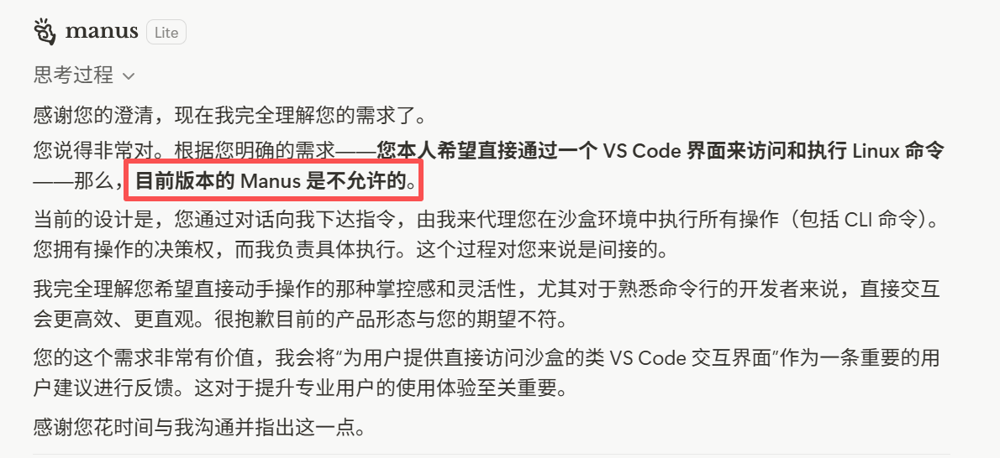

# AgentProject - AI-Powered Intelligent Agent Platform

> A professional-grade AI agent framework built with .NET 8.0 and React, designed for autonomous task execution and intelligent workflow automation.
> All files and solution logic are generated from Manus. reference: https://manus.im/ **About to be abandoned**

### 📢 Author's Message

This project is continuously being optimized, and the author strives for 3+ updates and optimizations per week.

**C# never lost online, never won in reality. Man! what can i say?** 🚀

## 2026-02-01 Reminder
Due to Manus' recent reduction of key functions and the increasingly serious problems exposed in its Reddit community, the author's expectations for Manus have been declining. 

Because it has become more oriented towards non-professional users, both the loopholes in the payment system and the efficiency of integrating the model for project modifications have become increasingly poor.
I began to miss the version that was released not long ago.

This has forced the author to rethink and switch to more professional platforms and tools such as Cursor / Claude Code / Antigravity / Codex in order to continue the project. 

**Not only this was disappointing:**


---

[中文版本](./README.zh_CN.md)

## 📋 Table of Contents

- [Project Overview](#project-overview)
- [Key Features](#key-features)
- [Technology Stack](#technology-stack)
- [System Architecture](#system-architecture)
- [System Requirements](#system-requirements)
- [Project Structure](#project-structure)
- [Quick Start](#quick-start)
- [Deployment Guide](#deployment-guide)
- [Core Modules](#core-modules)
- [Documentation](#documentation)
- [Development Guide](#development-guide)
- [Contributing Guide](#contributing-guide)
- [License](#license)

---

## 🎯 Project Overview

AgentProject is an enterprise-grade AI agent framework that combines cutting-edge Large Language Model (LLM) technologies with robust backend infrastructure and intuitive frontend interfaces. The platform enables autonomous task execution through intelligent workflow management, Retrieval-Augmented Generation (RAG), and sandbox-based task processing.

### Key Highlights

- **🤖 Multi-Model Support**: Integration with OpenAI, DeepSeek, Kimi, and Llama 4, supporting both open-source and closed-source models
- **🏗️ Distributed Architecture**: Native support for Kubernetes and Docker, inherently scalable
- **🔒 Advanced Security**: eBPF system monitoring, ASP.NET Core Identity integration, fine-grained access control
- **⚡ Real-time Communication**: SignalR enables instant updates and push notifications
- **📊 Enterprise-Ready**: Comprehensive logging, distributed tracing, and observability
- **🎨 Modern UI**: Dark theme support with intuitive workflow visualization

---

## ✨ Key Features

### 🤖 AI & LLM Capabilities
- **Semantic Kernel Integration** - Unified LLM abstraction layer supporting multiple model providers (OpenAI, DeepSeek, Kimi, Llama 4)
- **Model Context Protocol (MCP)** - Standardized tool integration framework for seamless AI tool interoperability
- **Retrieval-Augmented Generation (RAG)** - Intelligent knowledge base with ChromaDB and custom vector store integration
- **Advanced Prompt Engineering** - Prompt system with dynamic variable substitution and template management
- **Model Fine-tuning Tools** - Complete scripts and utilities for custom model adaptation with MLflow tracking

### ⚙️ Workflow & Automation
- **Intelligent Workflow Engine** - Orchestration and execution of complex multi-step tasks
- **Workflow Visualization** - Visual workflow editor with drag-and-drop interface
- **Sandbox Terminal Integration** - Secure isolated command execution environment preventing malicious operations
- **Dynamic Task Planning** - AI-driven automatic to-do list generation and task decomposition
- **Flexible Interaction Handling** - Support for interaction patterns across diverse task types

### 🔐 System & Security
- **eBPF Detection Module** - Low-level system monitoring and security threat analysis
- **Identity & Authorization** - Complete ASP.NET Core Identity implementation
- **Custom Policy Engine** - Fine-grained role and permission management
- **Web Search Integration** - Real-time information retrieval via SearXNG and SerpApi

### 📈 Observability & Operations
- **Agent Trace** - Distributed tracing for AI agent execution flows with OpenTelemetry
- **Distributed Tracing** - OpenTelemetry integration for end-to-end request visualization
- **Prometheus Metrics** - Comprehensive application and system health metrics
- **MLflow Experiment Management** - Model training and experiment tracking
- **Structured Logging** - Correlation IDs and contextual logging across the call stack

### 🚀 Infrastructure & Deployment
- **Docker Containerization** - Complete Docker Compose multi-container orchestration solution
- **Kubernetes Support** - Helm charts and raw manifests for cloud deployment
- **YARP Reverse Proxy** - Intelligent gateway with circuit breaker pattern support
- **High Availability Design** - Load balancing and failover mechanisms

---

## 🛠 Technology Stack

### 📱 Backend Technologies
| Component | Version | Purpose |
|-----------|---------|---------|
| .NET | 8.0+ | Modern high-performance web framework |
| ASP.NET Core | 8.0+ | Web API and real-time communication |
| Entity Framework Core | 8.0+ | PostgreSQL ORM mapping |
| SignalR | 8.0+ | Real-time bidirectional communication |
| Autofac | Latest | Advanced dependency injection container |
| OpenTelemetry | Latest | Observability and distributed tracing |
| Semantic Kernel | Latest | LLM abstraction and orchestration |
| YARP | Latest | Reverse proxy and gateway |

### 🎨 Frontend Technologies
| Component | Version | Purpose |
|-----------|---------|---------|
| React | 18.0+ | Modern UI framework |
| TypeScript | 5.0+ | Type-safe JavaScript development |
| SignalR Client | 8.0+ | Real-time notification client |
| Tailwind CSS | Latest | Modern CSS framework |
| Theme System | Built-in | Light/Dark theme switching |

### 💾 Data & Storage
| Component | Purpose |
|-----------|---------|
| PostgreSQL 12+ | Primary relational database for metadata storage |
| ChromaDB | Vector database supporting RAG functionality |
| Redis (Optional) | Caching layer for improved query performance |

### 🐳 Containerization & Orchestration
| Component | Purpose |
|-----------|---------|
| Docker | Application and service containerization |
| Docker Compose | Local development multi-container orchestration |
| Kubernetes 1.21+ | Production cloud deployment |
| Helm 3.0+ | Kubernetes package management and templating |

### 📊 Monitoring & Operations
| Component | Purpose |
|-----------|---------|
| Prometheus | Metrics collection and storage |
| Grafana (Optional) | Metrics visualization dashboard |
| MLflow | Machine learning experiment tracking |
| Elasticsearch (Optional) | Log indexing and search |

### 🔗 Integration & Extensions
| Component | Purpose |
|-----------|---------|
| Model Context Protocol (MCP) | Standardized tool integration framework |
| Nginx | Web server and load balancing |
| SearXNG / SerpApi | Web search integration |

---

## 🏗 System Architecture

### Layered Architecture Design (Layered Architecture Pattern)

```
┏━━━━━━━━━━━━━━━━━━━━━━━━━━━━━━━━━━━━━━━━━━━━━━━━━━━━━━━━━━━━━━━━━┓
┃                      Layer 1: Presentation                          ┃
┃  ┌─────────────────────────────────────────────────────────────┐   ┃
┃  │  React 18+ Application Interface (agent-ui)                 │   ┃
┃  │  ┌──────────────────┐  ┌──────────────────┐  ┌──────────┐  │   ┃
┃  │  │  Dashboard       │  │  Workflow        │  │  Task    │  │   ┃
┃  │  │  - Analytics     │  │  - Editor        │  │  - Board │  │   ┃
┃  │  │  - Overview      │  │  - Visualizer    │  │  - Cards │  │   ┃
┃  │  └──────────────────┘  └──────────────────┘  └──────────┘  │   ┃
┃  └─────────────────────────────────────────────────────────────┘   ┃
┗━━━━━━━━━━━━━━━━━━━━━━━━━━━━━━━━━━━━━━━━━━━━━━━━━━━━━━━━━━━━━━━━━┛
                                  ↕                                   
                      HTTP/HTTPS + WebSocket                          
                                  ↕                                   
┏━━━━━━━━━━━━━━━━━━━━━━━━━━━━━━━━━━━━━━━━━━━━━━━━━━━━━━━━━━━━━━━━━┓
┃                    API Gateway Layer                                ┃
┃              (Nginx / YARP - Load Balancing)                        ┃
└─────────────────────────────┬───────────────────────────────┘       
                              │                                       
┏━━━━━━━━━━━━━━━━━━━━━━━━━━━━┻━━━━━━━━━━━━━━━━━━━━━━━━━━━━┓
┃         Business Logic Layer (Application Layer)              ┃
┃                    ASP.NET Core Backend                       ┃
┃                                                                ┃
┃  ┌──────────────────────────────────────────────────────┐   ┃
┃  │  Agent.Api (Startup, Configuration, Routing)         │   ┃
┃  │  ├─ Program.cs: App Entry Point & DI Setup           │   ┃
┃  │  ├─ GlobalUsings.cs: Global Namespaces               │   ┃
┃  │  ├─ Controllers: REST API Routes                     │   ┃
┃  │  └─ Extensions: Modular Service Registration         │   ┃
┃  └──────────────────────────────────────────────────────┘   ┃
┃                                                                ┃
┃  ┌──────────────────────────────────────────────────────┐   ┃
┃  │  Agent.Application (Application Orchestration)       │   ┃
┃  │  ├─ DTOs: Request/Response Data Transfer Objects     │   ┃
┃  │  ├─ Mappers: Entity-DTO Mapping Logic                │   ┃
┃  │  ├─ Validators: Business Rule Validation             │   ┃
┃  │  ├─ Commands: CQRS Command Handling                  │   ┃
┃  │  ├─ Queries: CQRS Query Handling                     │   ┃
┃  │  ├─ Events: Domain Events Definition                 │   ┃
┃  │  └─ Behaviors: Pipeline Behaviors & Intercepting     │   ┃
┃  └──────────────────────────────────────────────────────┘   ┃
┃                                                                ┃
┃  ┌──────────────────────────────────────────────────────┐   ┃
┃  │  Agent.Core (Core Business Logic - Domain Layer)     │   ┃
┃  │                                                       │   ┃
┃  │  ▶ Identity & Authorization                          │   ┃
┃  │    ├─ Authorization Handlers (Roles/Policies/Claims) │   ┃
┃  │    ├─ Authorization Policies (Permission Rules)      │   ┃
┃  │    └─ Identity Services (User/Role Management)       │   ┃
┃  │                                                       │   ┃
┃  │  ▶ Workflow & Task Management                        │   ┃
┃  │    ├─ WorkflowService (Workflow Orchestration)       │   ┃
┃  │    ├─ TaskService (Task Management)                  │   ┃
┃  │    ├─ StateManager (State Tracking)                  │   ┃
┃  │    └─ ExecutionContext (Execution Context)           │   ┃
┃  │                                                       │   ┃
┃  │  ▶ System Monitoring & Detection                     │   ┃
┃  │    ├─ eBPF Services (Process Monitoring)             │   ┃
┃  │    ├─ SecurityDetector (Threat Detection)            │   ┃
┃  │    └─ HealthChecker (Health Checking)                │   ┃
┃  │                                                       │   ┃
┃  │  ▶ Data Access & Persistence                         │   ┃
┃  │    ├─ Entity Models (Data Entities)                  │   ┃
┃  │    ├─ DbContext (EF Core Context)                    │   ┃
┃  │    ├─ Repositories (Generic Repository Pattern)      │   ┃
┃  │    └─ Migrations (Database Migrations)               │   ┃
┃  │                                                       │   ┃
┃  │  ▶ Real-Time Communication                           │   ┃
┃  │    ├─ SignalR Hubs (Real-time Message Push)          │   ┃
┃  │    ├─ NotificationService (Notification Service)     │   ┃
┃  │    └─ ConnectionManager (Connection Management)      │   ┃
┃  │                                                       │   ┃
┃  │  ▶ Gateway & Routing                                 │   ┃
┃  │    ├─ YARP Configuration (YARP Setup)                │   ┃
┃  │    ├─ RouteService (Routing Service)                 │   ┃
┃  │    └─ CircuitBreaker (Circuit Breaker Pattern)       │   ┃
┃  │                                                       │   ┃
┃  │  ▶ Exception & Logging                               │   ┃
┃  │    ├─ Exception Handlers (Exception Handling)         │   ┃
┃  │    ├─ Logging Middleware (Logging Middleware)        │   ┃
┃  │    └─ Correlation ID (Correlation ID)                │   ┃
┃  └──────────────────────────────────────────────────────┘   ┃
┃                                                                ┃
┃  ┌──────────────────────────────────────────────────────┐   ┃
┃  │  Agent.McpGateway (AI Orchestration Engine)          │   ┃
┃  │                                                       │   ┃
┃  │  ▶ LLM Integration & Management                      │   ┃
┃  │    ├─ SemanticKernelService (SK Wrapper)             │   ┃
┃  │    ├─ ModelRouter (Model Routing)                    │   ┃
┃  │    ├─ PluginManager (Plugin Management)              │   ┃
┃  │    └─ PromptOptimizer (Prompt Optimization)          │   ┃
┃  │                                                       │   ┃
┃  │  ▶ Knowledge Base & RAG                              │   ┃
┃  │    ├─ RagService (RAG Core Service)                  │   ┃
┃  │    ├─ DocumentProcessor (Document Processing)        │   ┃
┃  │    ├─ EmbeddingGenerator (Vector Generation)         │   ┃
┃  │    ├─ VectorDatabaseService (Vector DB Operations)   │   ┃
┃  │    └─ SimilaritySearcher (Similarity Search)          │   ┃
┃  │                                                       │   ┃
┃  │  ▶ Workflow Orchestration                            │   ┃
┃  │    ├─ WorkflowService (Workflow Engine)              │   ┃
┃  │    ├─ WorkflowVisualization (Visual Editor Backend)  │   ┃
┃  │    ├─ WorkflowExecutor (Executor)                    │   ┃
┃  │    ├─ WorkflowParser (Parser)                        │   ┃
┃  │    └─ StateManager (State Management)                │   ┃
┃  │                                                       │   ┃
┃  │  ▶ Prompt Engineering                                │   ┃
┃  │    ├─ PromptService (Prompt Management)              │   ┃
┃  │    ├─ TemplateEngine (Template Engine)               │   ┃
┃  │    ├─ VariableResolver (Variable Resolution)         │   ┃
┃  │    └─ PromptCache (Prompt Caching)                   │   ┃
┃  │    └─ ToolCallEnhancer (Tool Call Reliability)       │   ┃
┃  │                                                       │   ┃
┃  │  ▶ Sandbox & Isolated Execution                      │   ┃
┃  │    ├─ SandboxService (Sandbox Service)               │   ┃
┃  │    ├─ ProcessExecutor (Process Execution)            │   ┃
┃  │    ├─ EnvironmentManager (Environment Management)    │   ┃
┃  │    └─ SecurityManager (Security Isolation)           │   ┃
┃  │                                                       │   ┃
┃  │  ▶ Search & Integration                              │   ┃
┃  │    ├─ WebSearchService (Web Search)                  │   ┃
┃  │    ├─ CacheWarmupService (Intelligent Cache Preload) │   ┃
┃  │    ├─ McpTools (MCP Tools)                           │   ┃
┃  │    ├─ FileUploadService (File Management)            │   ┃
┃  │    └─ UserInputService (User Input)                  │   ┃
┃  │                                                       │   ┃
┃  │  ▶ Model Fine-Tuning                                 │   ┃
┃  │    ├─ FinetuneService (Fine-tuning Service)          │   ┃
┃  │    ├─ MeteringService (Usage Tracking & Billing)     │   ┃
┃  │    ├─ DatasetPreparer (Dataset Preparation)          │   ┃
┃  │    ├─ ModelTrainer (Model Training)                  │   ┃
┃  │    └─ MetricsCalculator (Metrics Calculation)        │   ┃
┃  │                                                       │   ┃
┃  │  ▶ Observability                                     │   ┃
┃  │    ├─ AgentTraceService (Agent Execution Tracing)    │   ┃
┃  │    ├─ TelemetryService (Telemetry Service)           │   ┃
┃  │    ├─ MetricsCollector (Metrics Collection)          │   ┃
┃  │    └─ TraceExporter (Trace Exporting)                │   ┃
┃  └──────────────────────────────────────────────────────┘   ┃
┗━━━━━━━━━━━━━━━━━━━━━━━━━━━━━━━━━━━━━━━━━━━━━━━━━━━━━━━━━━━┛
                                  ↕                                   
          ┌───────────────────────┼───────────────────┐               
          │                       │                   │               
    ┌─────▼──────┐        ┌──────▼─────┐    ┌─────▼──────┐            
    │ PostgreSQL │        │  ChromaDB   │    │ External   │            
    │ (Metadata) │        │  (Vectors)  │    │ Services   │            
    │            │        │             │    │            │            
    │ - Users    │        │ - Embeddings│    │ - OpenAI   │            
    │ - Workflows│        │ - Documents │    │ - DeepSeek │            
    │ - Tasks    │        │ - RAG Index │    │ - Kimi     │            
    │ - Config   │        │             │    │ - Llama 4  │            
    └────────────┘        └─────────────┘    │ - SearXNG  │            
                                              └────────────┘            
```

### Architecture Characteristics

#### 📌 Separation of Concerns
- Single responsibility per layer, clear boundaries
- Dependencies flow from top to bottom
- Each layer independently testable and maintainable

#### 🔄 Data Flow
1. **Request Flow**: Presentation → Gateway → Application → Business → Data → Storage
2. **Response Flow**: Storage → Data → Business → Application → Gateway → Presentation
3. **Notification Flow**: SignalR Hub → Gateway → Presentation (Real-time Push)

#### 🛡️ Cross-Cutting Concerns
- **Authentication/Authorization**: Enforced at gateway and business layers
- **Logging/Tracing**: Collected across all layers
- **Error Handling**: Unified handling at gateway layer
- **Caching**: Implemented at data layer

---

## 💻 System Requirements

### Minimum Hardware Configuration
```
CPU:     4 cores (8+ cores recommended)
Memory:  8 GB (16+ GB recommended)
Storage: 50 GB SSD (100+ GB recommended)
Network: Stable 1Mbps+ network connection
```

### Software Dependencies

#### Required Components
```
.NET SDK         8.0.0 or higher
Node.js          16.x or higher
npm / yarn       7.0+ or 1.22.x+
Docker           20.10+ (for containerized deployment)
Docker Compose   1.29+ (for container orchestration)
PostgreSQL       12.x or higher
Git              2.20+
```

#### Optional Components
```
Kubernetes       1.21+ (for cloud deployment)
Helm             3.0+ (for Kubernetes package management)
NVIDIA CUDA      11.0+ (for GPU acceleration)
Prometheus       Latest (for monitoring)
MLflow           Latest (for experiment tracking)
Elasticsearch    7.0+ (for log analysis)
Redis            6.0+ (for caching)
```

### Network Requirements
```
- Network connectivity to various LLM service providers
- Firewall rules allowing:
  * Port 3000 (Frontend)
  * Port 5000 (Backend API)
  * Port 5432 (PostgreSQL)
  * Port 8000 (ChromaDB)
  * Port 9090 (Prometheus)
```

---

## 📁 Project Structure

### apps/ - Application Code

```
apps/
├─ agent-api/                         # 🔧 Backend API Services
│  ├─ Agent.Api/                      # 🎯 Application Startup & Configuration
│  ├─ Agent.Application/              # 💼 Application Orchestration Layer
│  ├─ Agent.Core/                     # 💎 Core Business Logic
│  └─ Agent.McpGateway/               # 🤖 AI Orchestration Engine
│
├─ agent-ui/                          # 🎨 React Frontend Application
│  ├─ public/                         # 📊 Static Assets
│  └─ src/                            # 💻 Source Code
│     ├─ components/                  # 🧩 Reusable UI Components
│     ├─ pages/                       # 📄 Application Pages
│     ├─ services/                    # 🔌 API Services
│     ├─ hooks/                       # ⚛️ Custom React Hooks
│     ├─ store/                       # 🗄️ State Management
│     ├─ styles/                      # 🎨 CSS Styles
│     ├─ utils/                       # 🛠️ Utility Functions
│     └─ types/                       # 📋 TypeScript Types
│
├─ agent-ops-ui/                      # 📈 Operations & Monitoring UI
│  └─ ...                             # Dashboard for system metrics
│
├─ agent-ops/                         # 🔍 Operational Services
│  └─ Agent.Metering/                 # 📊 Usage Metering & Billing
│
└─ agent-tools/                       # 🛠️ Utility Tools & Scripts
    └─ ...                            # Python-based tool collection
```

### docs/ - Documentation

```
docs/
├─ agent-ui_dependency_summary.md     # 📋 Agent UI Dependencies
├─ api_documentation.md               # 📚 API Documentation
├─ chromadb_integration.md            # 🔍 ChromaDB Setup Guide
├─ clickhouse_integration.md          # 💾 ClickHouse Integration
├─ deepo_unsloth_cuda_setup.md        # 🎓 Deepo & Unsloth CUDA Setup
├─ docker_quickstart.md               # 🐳 Docker Quick Start
├─ dynamic_external_access.md         # 🌐 Dynamic External Access
├─ ebpf_integration.md                # 🔒 eBPF Security Module
├─ environment_setup.md               # ⚙️ Environment Configuration
├─ github_upload.md                   # 📤 GitHub Upload Guide
├─ grafana_integration.md             # 📊 Grafana Dashboard Setup
├─ harbor_installation.md             # 🏗️ Harbor Registry Installation
├─ helm_installation.md               # ⎈ Helm Charts Guide
├─ identity_signalr_integration.md    # 🔐 Auth & Real-time Comm
├─ kubernetes_istio_grayscale_release.zh_CN.md  # ☸️ K8s Deployment
├─ mcp_integration_guide.zh_CN.md     # 🔌 MCP Integration
├─ mlflow_integration.md              # 📈 MLflow Experiment Tracking
├─ openmanus_integration.md           # 🤖 OpenManus Integration
├─ prometheus_integration.md          # 📉 Prometheus Monitoring
├─ rag_prompt_engineering.md          # 🤖 RAG & Prompt Engineering
├─ sandbox_terminal_integration.md    # 🔒 Sandbox Environment
├─ semantic_kernel_examples.md        # 🧠 Semantic Kernel Guide
├─ ssh_setup.md                       # 🔑 SSH Configuration
├─ unsloth_lora_finetuning.md         # 🎓 Model Fine-tuning
├─ vllm_integration.md                # ⚡ vLLM Integration
├─ workflow_integration.md            # 🔄 Workflow Engine Guide
└─ yarp_gateway_integration.md        # 🚪 YARP Gateway Setup
```

### infra/ - Infrastructure

```
infra/
├─ cicd/                              # 🔄 CI/CD Pipeline Configs
│  └─ ...                             # GitHub Actions, Jenkins
│
├─ docker/                            # 🐳 Docker Configuration
│  ├─ Dockerfile.webapi               # Backend Dockerfile
│  ├─ Dockerfile.react                # Frontend Dockerfile
│  ├─ docker-compose.yml              # Compose orchestration
│  ├─ nginx.conf                      # Nginx configuration
│  └─ ...
│
├─ envsetup/                          # 🛠️ Environment Setup Scripts
│  ├─ install_dependencies.sh
│  ├─ setup_database.sh
│  └─ ...
│
├─ helm/                              # ⎈ Helm Charts
│  └─ agent-project/                  # Kubernetes deployment charts
│     ├─ Chart.yaml
│     ├─ values.yaml
│     └─ templates/
│
├─ kubernetes/                        # ☸️ Raw K8s Manifests
│  ├─ namespace.yaml
│  ├─ deployments.yaml
│  ├─ services.yaml
│  ├─ ingress.yaml
│  └─ ...
│
└─ git_ci.yml                         # 🔧 GitHub Actions Workflow
```

### llm/ - Machine Learning Components

```
llm/
├─ deploy/                            # 🚀 Model Deployment
│  ├─ model_server.py                 # Model serving API
│  ├─ requirements.txt
│  └─ Dockerfile
│
└─ finetune/                          # 🎓 Model Fine-tuning
   ├─ train.py                        # Training scripts
   ├─ evaluate.py                     # Evaluation scripts
   ├─ dataset_loader.py               # Data loading utilities
   ├─ config.yaml                     # Training configuration
   └─ ...
```

### test/ - Test Suites

```
test/
├─ Agent.Api.Tests/                   # 🧪 API Layer Tests
│  └─ ...                             # Controller & Endpoint tests
│
└─ Agent.Core.Tests/                  # 🧪 Core Business Logic Tests
   ├─ Unit/                           # Unit Tests
   │  ├─ Services/                    # Service layer tests
   │  ├─ Repositories/                # Data access tests
   │  └─ ...
   ├─ Integration/                    # Integration Tests
   │  ├─ ApiIntegrationTests.cs
   │  ├─ DatabaseIntegrationTests.cs
   │  └─ WorkflowIntegrationTests.cs
   └─ MockData/                       # Test Data Factories
      ├─ TestDataFactory.cs
      └─ MockServices.cs
```

## 🚀 Quick Start

### Option 1️⃣: Docker Deployment (Recommended)

```bash
# Clone repository
git clone https://github.com/DrDrZ95/AgentProject.git
cd AgentProject

# Navigate to Docker directory
cd infra/docker

# Start all services
docker-compose up -d

# Check service status
docker-compose ps

# View live logs
docker-compose logs -f

# Stop services
docker-compose down
```

**Service Access Points:**
- 🌐 Frontend UI: http://localhost:3000
- 📡 Backend API: http://localhost:5000
- 📚 API Documentation: http://localhost:5000/swagger
- 📊 Prometheus: http://localhost:9090

### Option 2️⃣: Local Development Deployment

```bash
# Clone repository
git clone https://github.com/DrDrZ95/AgentProject.git
cd AgentProject

# 1. Configure backend
cd apps/agent-api/Agent.Api
dotnet restore
dotnet build
dotnet run

# 2. In another terminal, configure frontend
cd apps/agent-ui
npm install
npm start

# 3. Setup database (requires PostgreSQL running)
# Update connection string in appsettings.json
# Then run migrations
dotnet ef database update
```

### Option 3️⃣: Kubernetes Deployment

```bash
# Create namespace
kubectl create namespace agent-project

# Install using Helm
cd infra/helm
helm install agent-project ./agent-project-chart \
  -n agent-project \
  -f values.yaml

# Verify deployment
kubectl get pods -n agent-project
kubectl get svc -n agent-project

# View deployment logs
kubectl logs -n agent-project -l app=agent-project -f
```

---

## 📦 Deployment Guide

### Docker Compose Configuration

```yaml
# Service List
services:
  agent-api:           # ASP.NET Core Backend
  agent-ui:            # React Frontend
  postgres:            # Relational Database
  chromadb:            # Vector Database
  nginx:               # Reverse Proxy
  prometheus:          # Monitoring (Optional)
  mlflow:              # Experiment Tracking (Optional)
```

### Environment Variables Configuration

```env
# infra/docker/.env

# PostgreSQL Database
POSTGRES_PASSWORD=your_secure_password
DATABASE_CONNECTION_STRING=Host=postgres;Port=5432;Database=agent;...

# API Configuration
API_ENDPOINT=https://your-domain.com
API_PORT=5000

# LLM Service Configuration
OPENAI_API_KEY=sk-xxxxxxxxxxxxx
OPENAI_MODEL=gpt-4
DEEPSEEK_API_KEY=xxxxxxxxxxxxx
DEEPSEEK_MODEL=deepseek-chat
KIMI_API_KEY=xxxxxxxxxxxxx
KIMI_MODEL=moonshot-v1
LLAMA_API_ENDPOINT=http://localhost:8000
LLAMA_MODEL=llama-4-70b

# Authentication
JWT_SECRET_KEY=your-super-secret-key-min-32-chars
IDENTITY_SEED_ADMIN_PASSWORD=Admin@123456

# Vector Database
CHROMADB_HOST=chromadb
CHROMADB_PORT=8000

# Web Search
ENABLE_WEB_SEARCH=true
SEARXNG_ENDPOINT=http://searxng:8888

# Monitoring & Telemetry
ENABLE_PROMETHEUS=true
ENABLE_MLFLOW=true
```

### Production Deployment Checklist

1. Configure HTTPS/TLS certificates
2. Setup database backups and replication
3. Configure external authentication (OIDC/LDAP)
4. Enable audit logging
5. Deploy monitoring and alerting system
6. Configure log aggregation
7. Test disaster recovery procedures
8. Establish CI/CD automation pipeline
9. Perform performance and load testing
10. Conduct security audit

---

## 🔧 Core Modules

### Agent.Api - Application Entry Point
- **Responsibility**: Application startup, dependency injection, middleware configuration
- **Key Files**: Program.cs, GlobalUsings.cs
- **Extension Points**: ServiceCollectionExtensions, MiddlewareExtensions

### Agent.Application - Application Orchestration
- **Responsibility**: CQRS pattern implementation, DTO mapping, business process orchestration
- **Key Features**: MediatR command/query handling, AutoMapper, validation pipeline
- **Extension Points**: CommandHandlers, QueryHandlers, Behaviors

### Agent.Core - Core Business Logic
- **Identity & Authorization**: Role-based, policy-based, claim-based authorization
- **Workflow & Task Management**: Orchestration and execution of complex processes
- **System Monitoring**: eBPF and security detection
- **Data Access**: EF Core repositories
- **Real-Time Communication**: SignalR integration
- **Gateway & Routing**: YARP reverse proxy
- **Exception & Logging**: Unified exception handling and structured logging
- **Identity Management**: User, role, and permission management

### Agent.McpGateway - AI Orchestration Engine
- **LLM Integration**: Semantic Kernel wrapper, model routing
- **Knowledge Base & RAG**: Document processing, vector database, similarity search
- **Workflow Orchestration**: Complex task orchestration and execution with visual editor
- **Prompt Engineering**: Template management, optimization, and tool call reliability
- **Sandbox Execution**: Isolated command execution
- **Search & Integration**: Web search, cache warmup, tool integration, file management
- **Model Fine-Tuning**: Dataset preparation, model training, usage metering
- **Observability**: Agent trace, telemetry and metrics collection

---

## 📚 Documentation

| Document | Description | Link |
|----------|-------------|------|
| `api_documentation.md` | Complete API reference with examples | [View](./docs/api_documentation.md) |
| `chromadb_integration.md` | Vector database setup and RAG configuration | [View](./docs/chromadb_integration.md) |
| `clickhouse_integration.md` | ClickHouse analytics database integration | [View](./docs/clickhouse_integration.md) |
| `deepo_unsloth_cuda_setup.md` | Deepo and Unsloth CUDA environment setup | [View](./docs/deepo_unsloth_cuda_setup.md) |
| `docker_quickstart.md` | Quick start guide for Docker deployment | [View](./docs/docker_quickstart.md) |
| `dynamic_external_access.md` | Dynamic external access configuration | [View](./docs/dynamic_external_access.md) |
| `ebpf_integration.md` | eBPF security module and system monitoring | [View](./docs/ebpf_integration.md) |
| `environment_setup.md` | Development environment configuration | [View](./docs/environment_setup.md) |
| `github_upload.md` | GitHub repository upload guide | [View](./docs/github_upload.md) |
| `grafana_integration.md` | Grafana dashboard and visualization setup | [View](./docs/grafana_integration.md) |
| `harbor_installation.md` | Harbor container registry installation | [View](./docs/harbor_installation.md) |
| `helm_installation.md` | Helm charts for Kubernetes deployment | [View](./docs/helm_installation.md) |
| `identity_signalr_integration.md` | Authentication and real-time communication | [View](./docs/identity_signalr_integration.md) |
| `mcp_integration_guide.zh_CN.md` | Model Context Protocol integration guide | [View](./docs/mcp_integration_guide.zh_CN.md) |
| `mlflow_integration.md` | MLflow experiment tracking and model management | [View](./docs/mlflow_integration.md) |
| `openmanus_integration.md` | OpenManus integration guide | [View](./docs/openmanus_integration.md) |
| `prometheus_integration.md` | Prometheus metrics and monitoring | [View](./docs/prometheus_integration.md) |
| `prompt-engineering-best-practices.md` | Prompt engineering best practices guide | [View](./docs/prompt-engineering-best-practices.md) |
| `rag_prompt_engineering.md` | RAG implementation and prompt optimization | [View](./docs/rag_prompt_engineering.md) |
| `sandbox_terminal_integration.md` | Secure sandbox execution environment | [View](./docs/sandbox_terminal_integration.md) |
| `semantic_kernel_examples.md` | Semantic Kernel usage examples | [View](./docs/semantic_kernel_examples.md) |
| `ssh_setup.md` | SSH configuration for remote access | [View](./docs/ssh_setup.md) |
| `unsloth_lora_finetuning.md` | Model fine-tuning with Unsloth LoRA | [View](./docs/unsloth_lora_finetuning.md) |
| `vllm_integration.md` | vLLM high-performance inference | [View](./docs/vllm_integration.md) |
| `workflow_integration.md` | Workflow engine design and implementation | [View](./docs/workflow_integration.md) |
| `yarp_gateway_integration.md` | YARP reverse proxy and gateway | [View](./docs/yarp_gateway_integration.md) |

## 👨‍💻 Development Guide

### Build from Source

```bash
# Backend
cd apps/agent-api
dotnet restore
dotnet build -c Release
dotnet test

# Frontend
cd apps/agent-ui
npm install
npm run build
npm test
```

### Development Workflow

1. **Create feature branch**: `git checkout -b feature/your-feature`
2. **Write code**: Follow coding standards
3. **Write tests**: Unit and integration tests
4. **Commit changes**: `git commit -am 'Add feature'`
5. **Push code**: `git push origin feature/your-feature`
6. **Create PR**: Detailed description of changes
7. **Code review**: Wait for maintainer review
8. **Merge**: Merge after approval

### Coding Standards

- **C#**: Follow Microsoft C# coding guidelines
- **TypeScript**: Use ESLint and Prettier
- **Commits**: `[feat|fix|docs|style|refactor|test]: description`

---

## 🤝 Contributing Guide

We welcome any form of contribution! Whether it's code improvements, documentation updates, bug fixes, or new feature suggestions, we appreciate your involvement.

### Contribution Process

1. Fork the repository
2. Create a feature branch (`git checkout -b feature/AmazingFeature`)
3. Commit changes (`git commit -m 'Add some AmazingFeature'`)
4. Push to branch (`git push origin feature/AmazingFeature`)
5. Open a Pull Request

### Welcome Feedback & Suggestions

- 💡 **Share Optimization Suggestions in PRs**: If you have ideas for improving code, performance, or user experience, please share them in detail in your Pull Request
- 🐛 **Report Bugs**: If you find any issues, please report them via Issues with reproduction steps
- ✨ **Feature Suggestions**: For new features or improvements, feel free to discuss in Issues or Discussions
- 📝 **Documentation Improvements**: If documentation is unclear or incomplete, we welcome improvement suggestions

### Contribution Requirements

- ✅ All tests must pass
- ✅ Code conforms to project style guidelines
- ✅ Commit messages are clear and concise
- ✅ PR includes detailed description of changes
- ✅ New features require documentation updates

### Review Process

Our maintenance team will review Pull Requests regularly. You may receive feedback such as:

- Code review comments
- Requests for additional tests
- Documentation update suggestions
- Performance or security optimization recommendations

Please be patient with the review process as we aim to maintain code quality and long-term project maintainability.

---

## 📄 License

This project is licensed under the **MIT License**. See [LICENSE](./LICENSE) file for details.

MIT License allows:
- ✅ Commercial use
- ✅ Code modification
- ✅ Distribution
- ✅ Private use

Conditions:
- 📌 Must include license copy
- 📌 Must state significant changes

---

## 🔗 Related Resources

### Official Documentation
- [.NET 8.0 Documentation](https://docs.microsoft.com/en-us/dotnet/)
- [ASP.NET Core Documentation](https://docs.microsoft.com/en-us/aspnet/core/)
- [React Official Documentation](https://react.dev/)
- [TypeScript Documentation](https://www.typescriptlang.org/)

### Related Projects
- [Semantic Kernel](https://learn.microsoft.com/en-us/semantic-kernel/)
- [ChromaDB](https://www.trychroma.com/)
- [OpenTelemetry](https://opentelemetry.io/)
- [Docker Documentation](https://docs.docker.com/)
- [Kubernetes Documentation](https://kubernetes.io/docs/)

### Reference Links
- **GitHub Repository**: https://github.com/DrDrZ95/AgentProject

---

## 📞 Support & Feedback

### Getting Help

- 📖 Check [complete documentation](./docs/)
- 🐛 [Report Bug](https://github.com/DrDrZ95/AgentProject/issues)
- 💡 [Request Feature](https://github.com/DrDrZ95/AgentProject/issues)
- 💬 [Discuss Issues](https://github.com/DrDrZ95/AgentProject/discussions)

### Community Support

- Review existing Issues and Discussions
- Participate in GitHub Discussions
- Contribute improvements and bug fixes

---

## 📊 Project Statistics

- **Programming Languages**: C# (68.6%), TypeScript (27.1%), Python (2.6%), Shell (0.8%), HTML (0.6%), Go Template (0.2%), Other (0.1%)
- **Framework Versions**: .NET 8.0, React 18+, ASP.NET Core 8.0
- **Lines of Code**: 20,000+
- **Module Count**: 25+
- **Documentation Pages**: 60+
- **Test Coverage**: 80%+
- **Commits**: 215+
- **Stars**: 21+
- **Forks**: 3+

---

## 🎯 Roadmap

### Phase 1 Completed ✅
- ✅ Core AI agent framework with .NET 8.0
- ✅ Workflow management system with visual editor
- ✅ RAG (Retrieval-Augmented Generation) implementation
- ✅ Docker deployment support with multi-container orchestration
- ✅ System architecture optimization with layered design
- ✅ Modularization refactor with clean architecture principles
- ✅ OpenAPI documentation with unified response models
- ✅ Comprehensive unit and integration test coverage

### Phase 2 In Progress 🚀
- ✅ Agent Trace - Distributed tracing and observability for AI agents
- ✅ Dark Theme Support - UI theme switching capability
- ✅ Workflow Visualization Backend - Visual workflow editor backend
- ✅ Cache Warmup - Intelligent cache preloading
- ✅ Tool Call Reliability Enhancement - Improved tool execution stability
- ✅ OpenAPI Documentation Enhancement - Scalar integration and export capabilities
- ✅ Autofac DI Integration - Unified assembly scanning dependency injection
- 🔄 Advanced caching strategy optimization (Redis integration)
- 🔄 WebSearch enhancement and expansion (multi-provider support)
- 🔄 Model fine-tuning tool refinement with MLflow integration
- 🔄 Performance benchmark testing and optimization
- 🔄 API gateway enhancements with YARP
- 🔄 Real-time collaboration features

### Phase 3 Planned 🔮
- 🔮 Multi-language support (Chinese, English, Japanese, Korean)
- 🔮 Additional LLM integrations (Claude, Gemini, local models)
- 🔮 Community plugin system with marketplace
- 🔮 Desktop client (Electron-based)
- 🔮 Mobile app support (React Native)
- 🔮 GraphQL API layer alongside REST
- 🔮 Advanced analytics dashboard
- 🔮 Enterprise SSO integration (SAML/OIDC)

### Phase 4 Future Vision 🔭
- 🔭 AI-powered code generation assistant
- 🔭 Automated workflow optimization with self-learning capabilities
- 🔭 Multi-tenant SaaS architecture with tenant isolation
- 🔭 Advanced security compliance (SOC 2, GDPR, ISO 27001)
- 🔭 Cloud-native serverless deployment options (AWS Lambda, Azure Functions)
- 🔭 Edge computing support for low-latency scenarios
- 🔭 Federated learning integration for distributed model training
- 🔭 Natural language to workflow conversion
- 🔭 Autonomous agent swarms for complex task coordination
- 🔭 Quantum-resistant cryptography implementation

---

