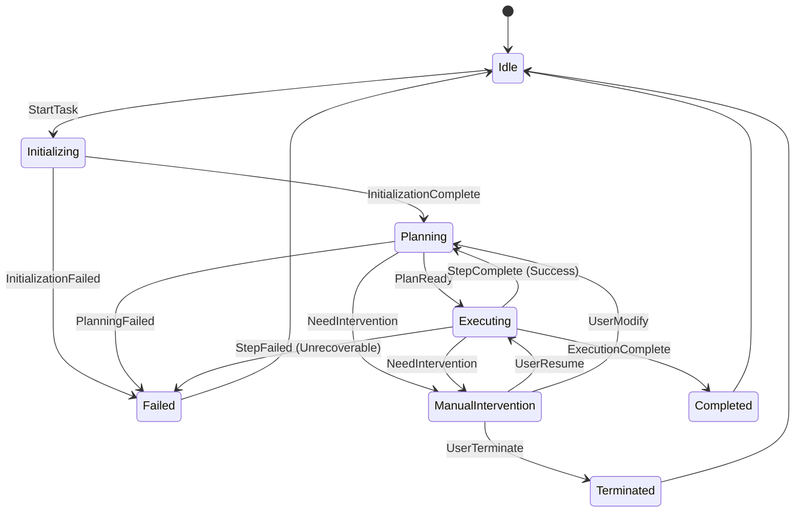

# Workflow Execution Engine Optimization and State Machine Design

## 1. 概述 (Overview)

本优化文档旨在为 AI Agent 的工作流执行引擎设计一个健壮的状态机模型 (State Machine Model)，以确保任务执行的可靠性、可控性和可追溯性。同时，详细定义了人工干预 (Manual Intervention) 的触发条件和交互流程，以实现人机协作的最佳实践。

*This document outlines the design for a robust State Machine Model for the AI Agent's workflow execution engine, ensuring reliability, controllability, and traceability. It also details the trigger conditions and interaction processes for Manual Intervention to enable best practices in human-AI collaboration.*

## 2. 执行引擎状态机模型 (Execution Engine State Machine Model)

工作流执行引擎的状态机是整个 Agent 系统的核心控制逻辑。它定义了任务从开始到结束的生命周期，以及在不同阶段之间的合法转换。

| 状态 (State) | 描述 (Description - Chinese) | 描述 (Description - English) | 触发转换 (Triggers) |
| :--- | :--- | :--- | :--- |
| **Idle** | 引擎空闲，等待新的工作流任务或用户指令。 | Engine is idle, waiting for a new workflow task or user command. | `StartTask` |
| **Initializing** | 任务初始化阶段，加载任务配置、上下文、所需工具和记忆模块。 | Task initialization phase, loading task configuration, context, required tools, and memory modules. | `InitializationComplete`, `InitializationFailed` |
| **Planning** | Agent 正在利用 LLM 制定或修正执行计划（如 ReAct 循环）。 | Agent is using the LLM to formulate or refine the execution plan (e.g., ReAct loop). | `PlanReady`, `NeedIntervention`, `PlanningFailed` |
| **Executing** | 正在执行计划中的一个步骤，通常是调用一个工具或能力。 | Executing a step in the plan, typically involving a tool or ability call. | `StepComplete`, `StepFailed`, `NeedIntervention` |
| **ManualIntervention** | 暂停执行，等待用户输入、确认或修正指令。 | Execution is paused, waiting for user input, confirmation, or corrected instructions. | `UserResume`, `UserModify`, `UserTerminate` |
| **Completed** | 任务成功完成，所有目标已达成。 | The task has been completed successfully, and all objectives have been met. | `ExecutionComplete` |
| **Failed** | 任务执行失败，无法恢复。 | The task execution failed and cannot be recovered. | `ExecutionFailed`, `PlanningFailed`, `InitializationFailed` |
| **Terminated** | 任务被用户或系统显式终止。 | The task was explicitly terminated by the user or the system. | `UserTerminate`, `SystemTimeout` |

### 状态转换图 (State Transition Diagram)

## 3. 人工干预机制 (Manual Intervention Mechanism)

人工干预机制是实现 Agent 可靠性和安全性的关键。它允许人类操作员在关键时刻介入，指导或修正 Agent 的行为。

### 3.1 触发条件 (Trigger Conditions)

Agent 引擎应在以下情况下自动或根据配置触发 `ManualIntervention` 状态：

| 触发条件 (Trigger Condition) | 描述 (Description) | 状态转换来源 (Source State) |
| :--- | :--- | :--- |
| **Sensitive Action** | Agent 准备执行高风险或敏感操作（如支付、修改关键系统配置）。 | `Planning`, `Executing` |
| **High-Confidence Failure** | 连续多次工具调用失败，或遇到无法解析的错误。 | `Executing` |
| **Ambiguity/Conflict** | LLM 无法在多个工具或计划路径中做出高置信度选择。 | `Planning` |
| **User Explicit Request** | 用户在运行时通过 UI 显式请求暂停或干预。 | `Planning`, `Executing` |
| **Security Policy Violation** | Agent 的行为触犯了预设的安全或合规策略。 | `Planning`, `Executing` |

### 3.2 交互流程 (Interaction Process)

当触发人工干预时，系统将遵循以下流程：

1.  **Pause & Transition**: 执行引擎立即暂停当前操作，并从 `Planning` 或 `Executing` 状态转换为 **`ManualIntervention`** 状态。
2.  **Notification**: 通过 SignalR 或其他实时通信机制，向用户界面发送通知，包含以下关键信息：
    *   **Reason**: 触发干预的原因（例如：`Sensitive Action: Preparing to execute system shutdown command`）。
    *   **Current State**: 当前工作流的完整上下文、执行历史和 Agent 的内部思考过程。
    *   **Proposed Action**: Agent 暂停前计划执行的下一步操作。
3.  **User Review & Action**: 用户在 UI 上查看信息，并选择以下操作之一：
    *   **继续执行 (UserResume)**: 确认 Agent 的下一步操作，引擎转换回 **`Executing`** 状态。
    *   **修改计划 (UserModify)**: 提供新的指令或修正 Agent 的计划，引擎转换回 **`Planning`** 状态。
    *   **终止任务 (UserTerminate)**: 停止整个工作流，引擎转换到 **`Terminated`** 状态。

## 4. SDK 引入说明 (SDK Introduction Note)

根据要求，我们将在不移除现有 SDK 的前提下，引入新的 SDK。在 `Agent.Core` 或 `Agent.Api` 项目中引入新 SDK 时，应遵循以下原则：

1.  **命名空间隔离**: 新旧 SDK 的相关代码应放置在不同的命名空间下，以避免命名冲突。
2.  **依赖注入**: 使用依赖注入 (Dependency Injection) 容器来管理新旧 SDK 的服务实例，允许在运行时轻松切换或并行使用。
3.  **版本兼容性检查**: 在引入新 SDK 后，将运行 `dotnet build` 进行版本兼容性检查。如果出现两个或更多的构建错误，将立即停止并报告错误。

*The new SDK will be introduced without removing the existing one. We will use separate namespaces and Dependency Injection for isolation. A build check will be performed, and if two or more build errors occur due to SDK version conflicts, the process will stop and report the errors.*
